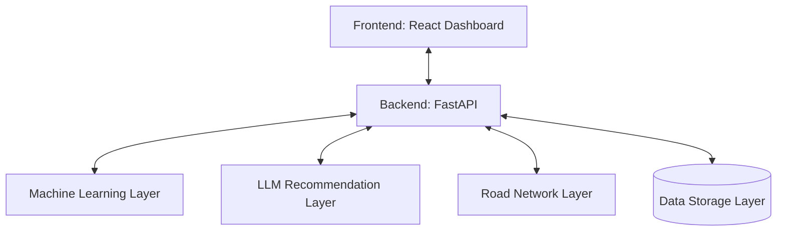
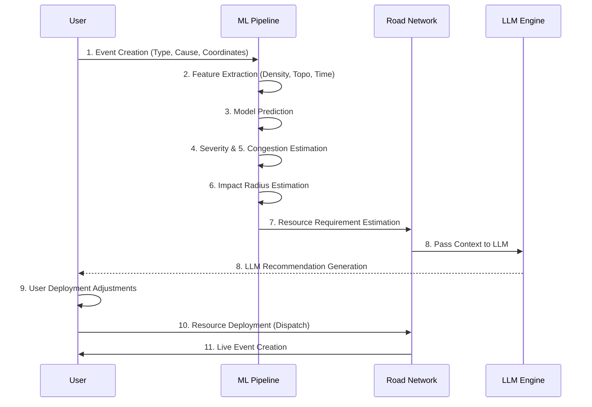

# Bengaluru Traffic AI: Predictive Event Impact & Resource Deployment Intelligence

## Project Overview
Bengaluru, known as India's Silicon Valley, faces immense challenges in traffic management due to rapid urbanization, an expanding vehicle population, and a complex, continuously evolving road network. Unplanned events—such as accidents, waterlogging, protests, or sudden VIP movements—can create cascading congestion that paralyzes entire corridors and severely strains emergency response systems.

**Bengaluru Traffic AI** is a state-of-the-art, AI-powered operational platform designed to address these challenges head-on. The platform provides predictive intelligence for traffic management authorities, city planners, and law enforcement agencies. By anticipating the impact of traffic and emergency events *before* they cascade, the system enables proactive resource deployment and strategic rerouting.

AI-assisted planning fundamentally shifts operational decision-making from a reactive scramble to a proactive, data-driven strategy. The key benefits include:
- **Reduced Response Times:** Deploying resources faster through automated severity and requirement estimation.
- **Optimized Resource Utilization:** Ensuring police stations deploy the right mix of officers, vehicles, and barricades without depleting reserves.
- **Minimized Network Impact:** Recommending alternative routes and predicting impact radius to isolate congestion.
- **Continuous Learning:** Archiving past events to continually retrain models and adapt to Bengaluru's changing traffic dynamics.

---
## Getting Started & Setup Walkthrough

This guide assumes you are setting up the project for the first time. Follow these steps to clone, configure, and start the application successfully on Windows, Linux, or macOS.

### 📋 Prerequisites

Ensure the following tools are installed on your machine:
1. **Python 3.9 or higher** (Ensure it is added to your system's PATH)
2. **Node.js 18 or higher** and **npm** (Comes bundled with Node.js)
3. **Git**

---

### ⚙️ Installation & Configuration

#### Step 1: Clone the Repository
```bash
git clone https://github.com/Anurag-2708/Bengaluru-Traffic-Control.git
cd Bengaluru-Traffic-Control
```

#### Step 2: Environment Variables Setup
We use `.env` files to configure options like ports and external API keys.
1. Duplicate `.env.example` in the project root and rename it to `.env`:
   ```bash
   cp .env.example .env
   ```
2. Open `.env` and fill in the values:
   * **`GEMINI_API_KEY`**: Provide your Google Gemini API key to enable LLM-generated action plans. (If left blank, the app will gracefully fall back to rule-based mock recommendations).
   * **`BACKEND_PORT`**: Port to run the FastAPI backend (default: `8000`).
   * **`FRONTEND_PORT`**: Port to run the React dashboard (default: `8501`).
   * **`VITE_API_URL`**: URL pointing to your backend (default: `http://localhost:8000`).

#### Step 3: Virtual Environment Setup

Setup virtual environment and download dependencies.
  ```bash
  python -m venv venv
  source venv/bin/activate  # On Windows: venv\Scripts\activate
  pip install -r requirements.txt
  ```

---

### Starting the Application

We provide a single cross-platform startup command that runs on **Windows, macOS, and Linux**.

Run the following command in the project root directory:
```bash
python run.py
```

#### What `run.py` does under the hood:
1. Loads configuration from your `.env` file.
2. Checks if frontend node dependencies (`node_modules`) are installed. If missing, it automatically installs them (`npm install`).
3. Starts the FastAPI backend inside the python virtual environment.
4. Starts the React/Vite frontend dashboard on your configured port.
5. Monitors both processes and gracefully cleans them up when you press `Ctrl+C`.

---

### Accessing the Application

* **Frontend Dashboard (React):** Open [http://localhost:8501](http://localhost:8501) in your browser.
* **Backend API Documentation (FastAPI):** Open [http://localhost:8000/docs](http://localhost:8000/docs) in your browser.

---

## System Architecture

The platform operates on a robust, multi-layered architecture designed for real-time responsiveness and deep analytical capability.



- **Frontend:** A high-performance React application utilizing Leaflet for interactive maps, designed as a premium, dark-mode operational dashboard.
- **Backend:** A FastAPI-based Python server that orchestrates simulations, resource allocations, and model inference.
- **Machine Learning Layer:** Uses an ensemble of LightGBM and XGBoost models trained on extensive historical data to predict severity, duration, and congestion.
- **LLM Recommendation Layer:** Integrates Large Language Models (like Google Gemini) to generate human-readable, context-aware operational strategies based on raw ML predictions.
- **Road Network Layer:** Utilizes OpenStreetMap (OSM) `.pbf` data and NetworkX to map Bengaluru's road topology, calculate shortest paths, and estimate travel times.
- **Data Storage Layer:** Local JSON/CSV-based data persistence managing live events, infrastructure capacities, and historical archives.

---

## Core Features

1. **Event Simulation:** Sandbox environment to model hypothetical incidents and predict their city-wide impacts before they occur.
2. **Live Events Monitoring:** Real-time tracking of active incidents, their severity, and their predicted resolution times.
3. **Infrastructure Management:** Total oversight of police stations, their locations, and available resources.
4. **Event Density Analysis:** Heatmap-based visualization of historical incident clusters to identify high-risk zones.
5. **Archives:** Comprehensive logs of resolved events used for operational review and continuous ML retraining.
6. **Model Retraining:** User-controlled mechanism to trigger model retraining using the latest archived data.
7. **Police Station Resource Management:** Dynamic tracking of officers, patrol vehicles, and barricades available versus deployed.
8. **Road Network Visualization:** Overlaying the actual road topology on maps to analyze connectivity and alternative routes.
9. **AI-Powered Recommendations:** Plain-text, actionable intelligence generated by LLMs to guide incident response.
10. **Traffic Impact Assessment:** Real-time prediction of congestion severity and impact radius (in kilometers) around an event.
11. **Resource Deployment Planning:** Algorithmic calculation of required resources and optimal dispatch routing from nearby stations.

---

## Event Simulation Pipeline

The simulation pipeline is the core predictive engine of the platform, transforming a simple user input into a full-scale deployment strategy.



1. **Event Creation:** The operator initiates a simulation by defining event type, cause, priority, and location.
2. **Feature Extraction:** The system calculates spatial, temporal, and infrastructure features based on the provided coordinates.
3. **Model Prediction:** The engineered features are passed to the ML layer.
4. **Severity Estimation:** The model predicts a severity index (1-10).
5. **Congestion Estimation:** The model predicts the expected traffic congestion level.
6. **Impact Radius Estimation:** Calculates the geographic spread of the disruption.
7. **Resource Requirement Estimation:** Rules engines map the severity to specific resource needs (officers, barricades).
8. **LLM Recommendation Generation:** Raw metrics are sent to the LLM, returning a strategic action plan.
9. **User Deployment Adjustments:** The operator reviews the AI's dispatch plan and can manually override resource quantities.
10. **Resource Deployment:** The system formally allocates resources, deducting them from station inventories.
11. **Live Event Creation:** The simulation transitions into an active, live-monitored event on the dashboard.

---

## Machine Learning Pipeline

The platform leverages advanced gradient boosting techniques to provide accurate impact forecasts.

- **Dataset Usage:** Built on extensive historical traffic and incident data specific to Bengaluru.
- **Feature Engineering Process:** Raw data is transformed into contextual features (e.g., proximity to junctions, hour of day).
- **Feature Selection Process:** High-variance and highly correlated features are pruned to prevent overfitting.
- **SHAP Analysis & Permutation Importance:** Used during training to ensure model interpretability and validate that the models rely on logical features (e.g., event cause over arbitrary geographic coordinates).
- **LightGBM & XGBoost Training:** Two distinct tree-based models are trained simultaneously to capture different non-linear relationships in the data.
- **Ensemble Strategy:** The predictions of LightGBM and XGBoost are averaged to reduce variance and improve robustness against outliers.
- **Model Evaluation Process:** Models are evaluated using Mean Absolute Error (MAE), Root Mean Square Error (RMSE), and R² metrics.
- **Predictive Role:** The ensemble predicts continuous targets (Duration, Impact Radius, Severity, Response Time). These outputs form the numerical foundation for resource allocation and LLM prompting.

### Feature Engineering Breakdown

High-quality predictions rely on rich context. Engineered features include:
- **Spatial Features:** Latitude/Longitude, distance to the city center, distance to major hubs.
- **Temporal Features:** Hour of day, day of week, rush hour flags, weekend indicators.
- **Event-Density Features:** Historical cluster densities around the event's coordinates.
- **Road-Network Features:** Node centrality, distance to the nearest major highway, intersection density.
- **Police Coverage Features:** Distance to the nearest police station, total number of stations within a 5km radius.
- **Resource-Related Features:** Real-time availability of officers and barricades in the immediate vicinity.

These features drastically improve prediction quality by providing the ML models with the same geographic and temporal context a human dispatcher would use.

---

## LLM Recommendation Engine

While ML models output raw numbers, human operators need tactical advice.

- **Data Handoff:** The predicted severity, duration, and resource deficits are serialized into a prompt template.
- **Recommendation Generation:** The LLM interprets the numbers in the context of Bengaluru's traffic norms.
- **Deployment Suggestions:** Provides specific advice, e.g., "Deploy heavy barricading at Silk Board Junction to prevent arterial spillover."
- **Resource Allocation Guidance:** Alerts operators if nearby stations are depleted and suggests pulling units from secondary stations.
- **Traffic Rerouting Suggestions:** Translates topological pathfinding into human-readable detour plans.
- **Operational Decision Support:** Acts as an AI co-pilot, reducing operator cognitive load during high-stress emergencies.

*Benefit:* Combining predictive ML with an LLM layer bridges the gap between statistical probability and actionable human strategy.

---

## Infrastructure Management

Effective incident response requires knowing exactly what resources are available.
- **Police Station Management:** Comprehensive catalog of all major Bengaluru traffic stations.
- **Officers, Vehicles, & Barricades:** Tracking of specific physical assets.
- **Available vs. Deployed Resources:** The system maintains a strict state of inventory. Resources deployed to live events are subtracted from the "available" pool until the event is resolved.
- **Deployment Tracking:** Operators can instantly see which stations are stretched thin and which have reserve capacity.

---

## Live Events

Once a simulation is deployed, it becomes a Live Event.
- **Event Lifecycle:** Transitions from Simulated -> Active -> Closed/Archived.
- **Active Time:** Real-time counter of how long the event has been ongoing.
- **Predicted Resolution Time:** Countdown based on the ML duration prediction.
- **Resource Monitoring:** Displays exactly which resources from which stations are tied up at the event.
- **Overdue Event Handling:** Visually alerts operators when an event exceeds its predicted duration.
- **Additional Deployment Workflows:** Allows operators to dispatch reinforcements if a live event escalates.

---

## Archives & Continuous Learning

The platform is designed to get smarter over time.
- **Event Closure Workflow:** When an event is resolved, the operator inputs the *actual* severity, duration, and resources used.
- **Archived Event Storage:** The event, along with the delta between predicted and actual metrics, is saved to the historical dataset.
- **Historical Event Review:** Operators can audit past events to identify systemic response failures.
- **Manual Retraining Process:** Administrators can trigger the retraining pipeline directly from the UI.
- **Why Retraining is User-Controlled:** Ensures models are only updated during off-peak hours and allows admins to vet the new archive data for anomalies before shifting the model weights.
- **Improvement Loop:** Newly archived data refines the feature relationships, making future predictions progressively more accurate.

---

## Density Map

Understanding historical patterns is crucial for urban planning.
- **Historical Event-Density Visualization:** Displays years of incident data on a high-performance Leaflet heatmap.
- **Clustering Approach:** Uses spatial clustering algorithms to group nearby events.
- **Zoom-Based Cluster Aggregation:** As the user zooms out, local hotspots aggregate into macro-level regional heat zones.
- **Hotspot Identification:** Visually highlights corridors (like the Outer Ring Road) that suffer from chronic congestion.
- **Use Cases:** Enables city administrators to plan infrastructure upgrades (e.g., new flyovers) and police planners to permanently reallocate base station resources to high-risk areas.

---

## Road Network

The platform understands the physical reality of Bengaluru's streets.
- **.pbf Road Network:** Ingests OpenStreetMap Protocolbuffer Binary Format data for highly accurate topological graphs.
- **Routing:** Calculates shortest paths and dynamic detours using algorithms like Dijkstra or A*.
- **Road Hierarchy:** Distinguishes between arterial highways, major roads, and residential streets for realistic routing.
- **Network-Based Analysis:** Calculates the betweenness centrality of intersections to identify critical bottlenecks.
- **Event Impact Assessment:** Uses network topology to predict exactly which adjacent streets will gridlock if a specific node is closed.

---

## User Interface

The frontend is engineered for high-pressure operational environments.
- **React Frontend:** Component-based, highly responsive single-page application.
- **Interactive Maps:** Deeply integrated Leaflet maps with custom vector overlays and dynamic radius shading.
- **Dashboard Layout:** A premium, dark-themed interface that reduces eye strain for operators working 24/7 shifts.
- **Data Visualizations:** Clean, intuitive charts and metric cards for rapid comprehension.
- **Resource Management Workflows:** Streamlined, click-efficient forms for dispatching resources in seconds.

---
*Built for Bengaluru. Powered by AI. Engineered for the future of urban mobility.*

---